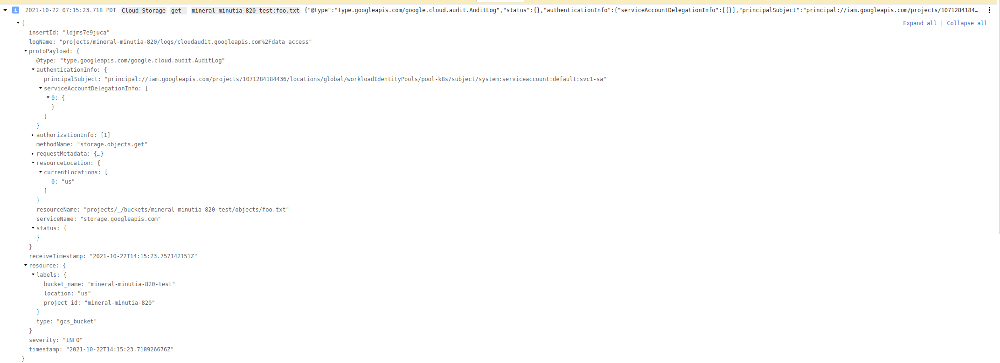
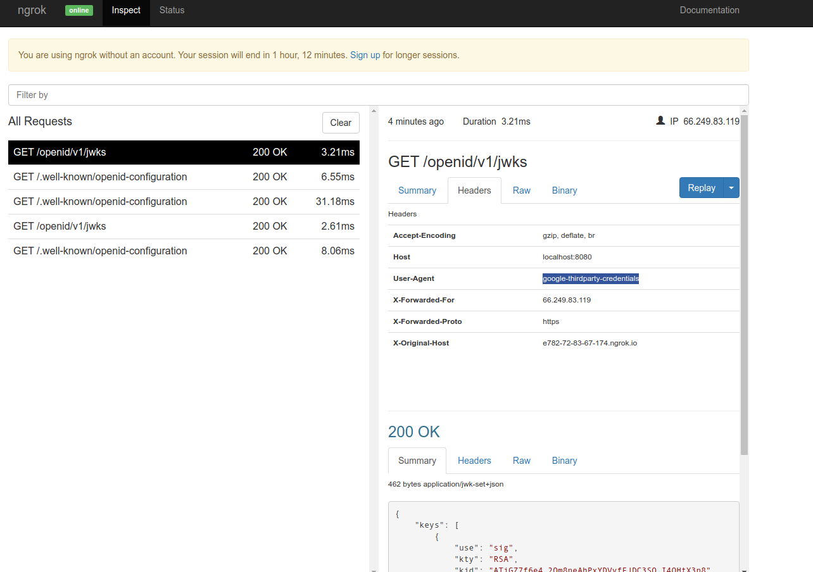

# Using Kubernetes Service Accounts for Google Workload Identity Federation

Or..how to use a plain-old [Kubernetes service account](https://kubernetes.io/docs/tasks/configure-pod-container/configure-service-account/) for authentication to Google Cloud.

With this technique, you can enable an onprem k8s cluster to directly authenticate and access GCP Services without needing to distribute [GCP Service Account Keys](https://cloud.google.com/kubernetes-engine/docs/tutorials/authenticating-to-cloud-platform#importing_credentials_as_a_secret) as a [Kubernetes Secret](https://kubernetes.io/docs/concepts/configuration/secret/).  First off, don't do that...dont' download a GCP service account key if you can help it (see [Best practices for securing service accounts](https://cloud.google.com/iam/docs/best-practices-for-securing-service-accounts))

Please note we are talking about two different Service Accounts:

* [GCP Service Accounts](https://cloud.google.com/iam/docs/service-accounts#default)
* [Kubernetes Service Accounts](https://kubernetes.io/docs/tasks/configure-pod-container/configure-service-account/)

This article focuses on using the Kubernetes Service account to authenticate to GCP and _optionally_ impersonate a GCP Service Account without needed to download a key.  Its basically federating the Kubernetes Cluster with GCP.

> This repo is NOT supported by Google


If your'e using GKE, don't bother reading this...just use the built in [Workload Identity](https://cloud.google.com/kubernetes-engine/docs/how-to/workload-identity).  If its a raw k8s service on AWS or Azure, see [Configuring workload identity federation](https://cloud.google.com/iam/docs/configuring-workload-identity-federation#aws) and [Anthos clusters](https://cloud.google.com/anthos/clusters/docs)

---

- How does this work?

  We will enable the k8s cluster you run onprem to use [GCP Workload Identity Federation](https://cloud.google.com/iam/docs/configuring-workload-identity-federation#oidc).  Essentially, we will establish trust with GCP that says: "trusts this [openid connect (OIDC)](https://openid.net/connect/)  token issued to a k8s service account by a given K8s API server and map it to this GCP `principal:// or principalSet://`.

- So can i login to kubernetes using an OIDC provider?

  No, thats not what this is about.  This tutorial is not about using an external OIDC provider to login and represent a k8s service.  This article is about the other way:  using the default k8s service identity to access GCP.   If you're interested in the former, you can stop reading and see some of the many tutorials about that

  - [Kubernetes Authentication with OpenID Connect](https://kubernetes.io/docs/reference/access-authn-authz/authentication/#openid-connect-tokens)
  - and a tutorial here [Kubernetes RBAC with Google Cloud Identity Platform/Firebase Tokens](https://github.com/salrashid123/kubernetes_oidc_gcp_identity_platform)

- How does this really work?

  We will run a k8s server and specifically ask it to surface its OpenID Connect Discovery endpoint:
  - [Service Account Issuer Discovery](https://kubernetes.io/docs/tasks/configure-pod-container/configure-service-account/#service-account-issuer-discovery)

  What that allows us to do is bind the kubernetes metadata for OIDC with GCP and establish trust/federation between them.  We will setup a rule that basically says to GCP: "ok, trust an OIDC JWT token issued and digitally signed by this provider".  When a kubernetes service uses its ambient service account token, it can be used to authentiate to GCP since we setup this trust.

- Whats the catch?

  Well, for one you need to make the OIDC metadata for your kubernetes cluster visible to GCP externally.

- For this demo, how can GCP see the minikube discovery on my laptop?

  This is just a tutorial you can run on your laptop as a demo.  As its a tutorial, we're entitled to make many shortcuts.  One of them is "exposing" the discovery endpoint for minikube and we do that by setup a free tunnel from the internet to your laptop.  Yes, we're going to use  [ngrok](https://ngrok.com/)

- `ngrok` free edition is limited to 2hours?

  Yes, we will work fast for this demo.


### Setup

First install the following on your laptop

* [minikube](https://minikube.sigs.k8s.io/docs/)
* [ngrok](https://ngrok.com/)
* optionally [jq](https://stedolan.github.io/jq/)


### Configure ngrok Tunnel

First Step is to run `ngrok` and find out the URL its assigned to you

```bash
./ngrok http -host-header=rewrite  localhost:8080
```


What this means is the url `https://e782-72-83-67-174.ngrok.io` will map to my localhost on port `:8080`

We will use this as the discovery endpoint for kubernetes and GCP

### Start Minikube

Now use that to setup Minikube and enable the `ServiceAccountIssuerDiscovery` feature gate

```bash
export DISCOVERY_URL="https://e782-72-83-67-174.ngrok.io"
minikube start --driver=kvm2  --feature-gates=ServiceAccountIssuerDiscovery=true \
    --extra-config=apiserver.service-account-jwks-uri=$DISCOVERY_URL/openid/v1/jwks \
    --extra-config=apiserver.service-account-issuer=$DISCOVERY_URL

# enable the cluster role bindng to expose the discovery server
kubectl create clusterrolebinding oidc-reviewer --clusterrole=system:service-account-issuer-discovery --group=system:unauthenticated
```

Create a proxy that will allow external clients access to the minikube oidc discovery endpoint

```bash
kubectl proxy --port=8080  --accept-paths="^/\.well-known\/openid-configuration|^/openid\/v1\/jwks" 
```

Test that you can see the discovery endpoint from the internet though ngrok

```bash
curl -s $DISCOVERY_URL/.well-known/openid-configuration | jq '.'

{
  "issuer": "https://e782-72-83-67-174.ngrok.io",
  "jwks_uri": "https://e782-72-83-67-174.ngrok.io/openid/v1/jwks",
  "response_types_supported": [
    "id_token"
  ],
  "subject_types_supported": [
    "public"
  ],
  "id_token_signing_alg_values_supported": [
    "RS256"
  ]
}
```

```bash
curl -s $DISCOVERY_URL/openid/v1/jwks | jq '.'

{
  "keys": [
    {
      "use": "sig",
      "kty": "RSA",
      "kid": "ATiGZ7f6e4_2Qm8neAhPxYDVyfFJDC3SQ_I4QHtX3n8",
      "alg": "RS256",
      "n": "2MFcWAjyDgU4b69VIbRCDhWvsCUuZKr0OBAYVIJFKDV6aG5QKrd6slZHBqYT_hiHRBJh0dKwP5u6OCtWiCpS7okGGtIBrgSsYz5A7iR2mVoDwTjLyBoyImJoo-pEO_BZLMrFxHf68GNoDoicmI1ZYa-WAA2-5RTqh9IunVltvjdj61hCuhMzV8E_taU727vVXQc8GjZUvaRC6aTVAlJOejAxKRijSDtpOf-qj-VgvQMv9pgVAeCbDXOLuFrHJPJSAiT50gvlnC3Mj0QRIL-EkD9OqW8RX8lgeriD3jp6RDe4xPSVETAiIMitTvwoyTl4BCwjyLn8Xq5_JjGJJ6BGgQ",
      "e": "AQAB"
    }
  ]
}
```

You can optionally view the traffic from the internet through ngrock by looking at the console [http://localhost:4040/](http://localhost:4040/)

### Deploy k8s Service Account 

Deploy a sample applicaton within this cluster.

The following will crate a new serviceAccount and a [Service Account Token Volume Projection](https://kubernetes.io/docs/tasks/configure-pod-container/configure-service-account/#service-account-token-volume-projection).   

k8s will mount the service account's token at `/var/run/secrets/iot-token` and will include an arbitrary audience we set `gcp-sts-audience`.  This value can be anything but we will use this specific one later when setting up the federation constraints.

```yaml
apiVersion: v1
kind: ServiceAccount
metadata:
  name: svc1-sa
---
apiVersion: v1
kind: Secret
type: kubernetes.io/service-account-token
metadata:
  name: mysecretname
  annotations:
    kubernetes.io/service-account.name: svc1-sa
---
apiVersion: apps/v1
kind: Deployment
metadata:
  name: myapp-deployment
  labels:
    type: myapp-deployment-label
spec:
  replicas: 2
  selector:
    matchLabels:
      type: myapp
  template:
    metadata:
      labels:
        type: myapp
        tier: frontend
        version: v1
    spec:
      serviceAccountName: svc1-sa    
      containers:
      - name: frontend
        image: debian
        args:
        - sleep
        - "1000000"
        volumeMounts:
        - mountPath: /var/run/secrets/iot-token
          name: iot-token         
      volumes:
      - name: iot-token
        projected:
          sources:
          - serviceAccountToken:
              path: iot-token
              expirationSeconds: 7200
              audience: gcp-sts-audience
```

Apply the configuration and view the token

```bash
# we will need these later
export PROJECT_ID=`gcloud config get-value core/project`
export PROJECT_NUMBER=`gcloud projects describe $PROJECT_ID --format='value(projectNumber)'`


$ envsubst < "my-deployment.yaml.tmpl" > "my-deployment.yaml"
$ kubectl apply -f my-deployment.yaml
```

Note, the deployment has some extra configmaps and volumes...those aren't used here but i'll explain those later

```bash
$ kubectl get po
  NAME                                READY   STATUS    RESTARTS   AGE
  myapp-deployment-86d84cff8f-ckljb   1/1     Running   0          26s
  myapp-deployment-86d84cff8f-nkshd   1/1     Running   0          26s

$ kubectl exec -ti myapp-deployment-86d84cff8f-ckljb  cat /var/run/secrets/iot-token/iot-token

eyJhbGciOiJSUzI1NiIsImtpZCI6IkFUaUdaN2Y2ZTRfMlFtOG5lQWhQeFlEVnlmRkpEQzNTUV9JNFFIdFgzbjgifQ.eyJhdWQiOlsiZ2NwLXN0cy1hdWRpZW5jZSJdLCJleHAiOjE2MzQ5MTY2MDAsImlhdCI6MTYzNDkwOTQwMCwiaXNzIjoiaHR0cHM6Ly9lNzgyLTcyLTgzLTY3LTE3NC5uZ3Jvay5pbyIsImt1YmVybmV0ZXMuaW8iOnsibmFtZXNwYWNlIjoiZGVmYXVsdCIsInBvZCI6eyJuYW1lIjoibXlhcHAtZGVwbG95bWVudC04NmQ4NGNmZjhmLWNrbGpiIiwidWlkIjoiY2JhNTVlZGMtYmMwOC00YjVkLWJmZTEtYzBhMTA5YWVkYjVmIn0sInNlcnZpY2VhY2NvdW50Ijp7Im5hbWUiOiJzdmMxLXNhIiwidWlkIjoiZTQxNmE5OTEtNmE2Ni00ODc3LWJhMjYtYTk3YTYwZjQ0ZjIyIn19LCJuYmYiOjE2MzQ5MDk0MDAsInN1YiI6InN5c3RlbTpzZXJ2aWNlYWNjb3VudDpkZWZhdWx0OnN2YzEtc2EifQ.mFf5VEdeFXhi2I7tYN5ORToKeEPlnRW3uNPUGEkcozMtNAGVrL0bRKm7eaQHWilpdxFJ3gjN7RjHOqP0e-4dsHl_zE2Sey2U8nDY7nr9b7pdjCavnjQ3FQaqswl7AYIcgRx0j5RY7xMaHKJxmvURvwvu-oW17rGpMpy8Ee7paS7NqBj7LiaNbIDNhQaJ1ymQx0VuqodycYa_nPeS8gJlbg7zlFszk_gZfLrzy9KxKGpUVknmTpXL4QfPQxVWd783nNx4y-J1mDq_lt8bmYLRJH40GRcZb5UweSWLWJMbxJJFrdi_iVTu9KBItKbn_UNu7E1DL2_gWUh8kyrUBGthzw
```

You can decode that JWT token at [jwt.io](jwt.io).  For the example above

```json
{
  "alg": "RS256",
  "kid": "ATiGZ7f6e4_2Qm8neAhPxYDVyfFJDC3SQ_I4QHtX3n8"
}.
{
  "aud": [
    "gcp-sts-audience"
  ],
  "exp": 1634916600,
  "iat": 1634909400,
  "iss": "https://e782-72-83-67-174.ngrok.io",
  "kubernetes.io": {
    "namespace": "default",
    "pod": {
      "name": "myapp-deployment-86d84cff8f-ckljb",
      "uid": "cba55edc-bc08-4b5d-bfe1-c0a109aedb5f"
    },
    "serviceaccount": {
      "name": "svc1-sa",
      "uid": "e416a991-6a66-4877-ba26-a97a60f44f22"
    }
  },
  "nbf": 1634909400,
  "sub": "system:serviceaccount:default:svc1-sa"
}
```

Note the `issuer`, `aud` and `sub` fields.  We will later configure GCP federation to use these claims to map to an identity

### Configure Workload Identity Federation


  - [Exchange Generic OIDC Credentials for GCP Credentials using GCP STS Service](https://github.com/salrashid123/gcpcompat-oidc)


```bash
export PROJECT_ID=`gcloud config get-value core/project`
export PROJECT_NUMBER=`gcloud projects describe $PROJECT_ID --format='value(projectNumber)'`


gcloud beta iam workload-identity-pools create pool-k8s \
    --location="global" \
    --description="k8s OIDC Pool" \
    --display-name="k8s OIDC Pool" --project $PROJECT_ID

gcloud beta iam workload-identity-pools providers create-oidc oidc-provider-k8s-1 \
    --workload-identity-pool=pool-k8s \
    --issuer-uri="$DISCOVERY_URL" \
    --location="global" \
    --attribute-mapping="google.subject=assertion.sub,attribute.aud=assertion.aud[0]" \
    --allowed-audiences="gcp-sts-audience" \
    --project $PROJECT_ID    
```


At this moment we are saying, "an OIDC token issued by the provider at `$DISCOVERY_URL` is trusted but as long as its audience is `gcp-sts-audience` and map the sub field to the google `Subject` and also map the audience values."

So, in our case an OIDC token issued by the service we just deployed will be identified as

`"principal://iam.googleapis.com/projects/$PROJECT_NUMBER/locations/global/workloadIdentityPools/oidc-pool-k8s/subject/system:serviceaccount:default:svc1-sa"`

(i'm using just `principal://` here but in reality you'd use groups, etc `principalSet://`)

For now create a gcs bucket and allow this principal access to it.   Only certain services like IAM and GCS support using the `principal://` federated accounts.  If you want to access all other GCP services, you need to use that principal:// and make it exchange its token for another GCP service account that has access (yeah, its a bit confusing)

*Note* that we are giving it full project level admin right..do not do this in reality...i just think our GCS services and cloud console do not allow setting it at the bucket level  (it'm sure its possible, i just don't know how to)

```bash
gsutil mb gs://$PROJECT_ID-test
echo fooooo > foo.txt
gsutil cp foo.txt gs://$PROJECT_ID-test

gcloud projects add-iam-policy-binding $PROJECT_ID  \
 --member "principal://iam.googleapis.com/projects/$PROJECT_NUMBER/locations/global/workloadIdentityPools/pool-k8s/subject/system:serviceaccount:default:svc1-sa" \
 --role roles/storage.objectAdmin
```

Remember we mentioned that _raw_ federated tokens work for limited set of GCP services (GCS and IAM)..so if you wanted to test for other apis like pubsub, create a new service account, allow our principal to impersonate it and then grant that second service account permissions to the GCP resource (eg, pubsub).  In this case, we're allowing the federated token to use IAM api to impersonate `oidc-federated@$PROJECT_ID.iam.gserviceaccount.com` which inturn has access to the bucket.  As mentioned GCS already supports raw federated tokens but we're doing this here incase you want see how to do the other bindings.

```bash
gcloud iam service-accounts create oidc-federated
gcloud iam service-accounts add-iam-policy-binding oidc-federated@$PROJECT_ID.iam.gserviceaccount.com \
    --role roles/iam.workloadIdentityUser \
    --member "principal://iam.googleapis.com/projects/$PROJECT_NUMBER/locations/global/workloadIdentityPools/pool-k8s/subject/system:serviceaccount:default:svc1-sa"

gcloud projects add-iam-policy-binding $PROJECT_ID  \
 --member "serviceAccount:oidc-federated@$PROJECT_ID.iam.gserviceaccount.com" \
 --role roles/storage.objectAdmin    
```

We're now ready to test the federation 

```bash
export OIDC_TOKEN=`kubectl exec -ti myapp-deployment-86d84cff8f-ckljb  cat /var/run/secrets/iot-token/iot-token`

curl -s -X POST    -d "grant_type=urn:ietf:params:oauth:grant-type:token-exchange"  \
   -d "audience=//iam.googleapis.com/projects/$PROJECT_NUMBER/locations/global/workloadIdentityPools/pool-k8s/providers/oidc-provider-k8s-1" \
   -d "subject_token_type=urn:ietf:params:oauth:token-type:jwt" \
   -d "requested_token_type=urn:ietf:params:oauth:token-type:access_token" \
   -d "scope=https://www.googleapis.com/auth/cloud-platform" \
   -d "subject_token=$OIDC_TOKEN"     https://sts.googleapis.com/v1beta/token | jq '.'
```

with a little bit of luck you should see

```
{
  "access_token": "ya29.d..",
  "issued_token_type": "urn:ietf:params:oauth:token-type:access_token",
  "token_type": "Bearer",
  "expires_in": 3600
}
```

Now use that access token to read the GCS bucket

```bash
export ACCESS_TOKEN=....

$curl -s -H "Authorization: Bearer $ACCESS_TOKEN" https://storage.googleapis.com/storage/v1/b/$PROJECT_ID-test/o/foo.txt
```

If you had GCS data access logs enabled, you'd see:



  
btw, you should also see GCP trying to access the discovery endpoint on the ngrok console (note the source ip on the console `66.249.83.119`, thats coming from GCP)
 



### Using ADC from the POD

Finally, we just tested this out manually. How would you access this from inside the pod transparently?

First we need to create an [Application Default Credentials file](https://cloud.google.com/iam/docs/configuring-workload-identity-federation#oidc) for OIDC Federation.

Please note that we are specifying the `--credential-source-file`  to use the secret volume mount on the pod `/var/run/secrets/iot-token/iot-token`.  That way, ADC will automatically know where to look.

```bash
gcloud beta iam workload-identity-pools create-cred-config  \
  projects/$PROJECT_NUMBER/locations/global/workloadIdentityPools/pool-k8s/providers/oidc-provider-k8s-1   \
  --service-account=oidc-federated@$PROJECT_ID.iam.gserviceaccount.com   \
  --output-file=sts-creds.json  \
  --credential-source-file=/var/run/secrets/iot-token/iot-token
```

for me the `sts-cred.json` file looked like this

```json
$ more sts-creds.json 
{
  "type": "external_account",
  "audience": "//iam.googleapis.com/projects/12345678/locations/global/workloadIdentityPools/pool-k8s/providers/oidc-provider-k8s-1",
  "subject_token_type": "urn:ietf:params:oauth:token-type:jwt",
  "token_url": "https://sts.googleapis.com/v1/token",
  "credential_source": {
    "file": "/var/run/secrets/iot-token"
  },
  "service_account_impersonation_url": "https://iamcredentials.googleapis.com/v1/projects/-/serviceAccounts/oidc-federated@your-project-id.iam.gserviceaccount.com:generateAccessToken"
}
```

What we are going to do is mount this file into the deployment as a configmap

```yaml
apiVersion: v1
kind: ServiceAccount
metadata:
  name: svc1-sa
---
apiVersion: v1
kind: Secret
type: kubernetes.io/service-account-token
metadata:
  name: mysecretname
  annotations:
    kubernetes.io/service-account.name: svc1-sa
---
apiVersion: apps/v1
kind: Deployment
metadata:
  name: myapp-deployment
  labels:
    type: myapp-deployment-label
spec:
  replicas: 2
  selector:
    matchLabels:
      type: myapp
  template:
    metadata:
      labels:
        type: myapp
        tier: frontend
        version: v1
    spec:
      serviceAccountName: svc1-sa    
      containers:
      - name: frontend
        image: debian
        args:
        - sleep
        - "1000000"
        env:
        - name: GOOGLE_APPLICATION_CREDENTIALS
          value: "/adc/creds/sts-creds.json"         
        volumeMounts:
        - mountPath: /var/run/secrets/iot-token
          name: iot-token
        - mountPath: /adc/creds
          name: adc-config-vol             
      volumes:
      - name: iot-token
        projected:
          sources:
          - serviceAccountToken:
              path: iot-token
              expirationSeconds: 7200
              audience: gcp-sts-audience
      - name: adc-config-vol
        configMap:
          name: adc-config             
---
apiVersion: v1
kind: ConfigMap
metadata:
  name: adc-config
data:
  sts-creds.json: |
    {
      "type": "external_account",
      "audience": "//iam.googleapis.com/projects/12345678/locations/global/workloadIdentityPools/pool-k8s/providers/oidc-provider-k8s-1",
      "subject_token_type": "urn:ietf:params:oauth:token-type:jwt",
      "token_url": "https://sts.googleapis.com/v1/token",
      "credential_source": {
        "file": "/var/run/secrets/iot-token/iot-token"
      },
      "service_account_impersonation_url": "https://iamcredentials.googleapis.com/v1/projects/-/serviceAccounts/oidc-federated@your-project-id.iam.gserviceaccount.com:generateAccessToken"
    }
```

```bash
kubectl delete -f my-deployment.yaml
kubectl apply -f my-deployment.yaml

$ kubectl get po
NAME                                READY   STATUS    RESTARTS   AGE
myapp-deployment-548bb79f55-brddj   1/1     Running   0          64s
myapp-deployment-548bb79f55-gpxms   1/1     Running   0          64s
```

now verify everything is there:

```bash
$ kubectl exec -ti myapp-deployment-548bb79f55-brddj /bin/bash

root@myapp-deployment-548bb79f55-brddj:/# echo $GOOGLE_APPLICATION_CREDENTIALS
/adc/creds/sts-creds.json

root@myapp-deployment-548bb79f55-brddj:/# cat /adc/creds/sts-creds.json
{
  "type": "external_account",
  "audience": "//iam.googleapis.com/projects/12345678/locations/global/workloadIdentityPools/pool-k8s/providers/oidc-provider-k8s-1",
  "subject_token_type": "urn:ietf:params:oauth:token-type:jwt",
  "token_url": "https://sts.googleapis.com/v1/token",
  "credential_source": {
    "file": "/var/run/secrets/iot-token/iot-token"
  },
  "service_account_impersonation_url": "https://iamcredentials.googleapis.com/v1/projects/-/serviceAccounts/oidc-federated@your-project-id.iam.gserviceaccount.com:generateAccessToken"
}

root@myapp-deployment-548bb79f55-brddj:/# cat /var/run/secrets/iot-token/iot-token
eyJhbGciOiJSUzI1NiIsImtpZCI6IkFUaUdaN2Y2ZTRfMlFtOG5lQWhQeFlEVnlmRkpEQzNTUV9JNFFIdFgzbjgifQ.eyJhdWQiOlsiZ2NwLXN0cy1hdWRpZW5jZSJdLCJleHAiOjE2MzQ5MjE2ODUsImlhdCI6MTYzNDkxNDQ4NSwiaXNzIjoiaHR0cHM6Ly9lNzgyLTcyLTgzLTY3LTE3NC5uZ3Jvay5pbyIsImt1YmVybmV0ZXMuaW8iOnsibmFtZXNwYWNlIjoiZGVmYXVsdCIsInBvZCI6eyJuYW1lIjoibXlhcHAtZGVwbG95bWVudC01NDhiYjc5ZjU1LWJyZGRqIiwidWlkIjoiYmZmYWM5ZGYtZTM2ZS00YTdmLTljZDQtNTUxNmVjZTYzNmQ5In0sInNlcnZpY2VhY2NvdW50Ijp7Im5hbWUiOiJzdmMxLXNhIiwidWlkIjoiYWFkMGJiNzAtYWJlZi00MjBmLTg4NDMtMTM5ZjVkNDBkMWE2In19LCJuYmYiOjE2MzQ5MTQ0ODUsInN1YiI6InN5c3RlbTpzZXJ2aWNlYWNjb3VudDpkZWZhdWx0OnN2YzEtc2EifQ.jkpdNcoNmnNvNSHPox55cmLL6Gma3JkcPsXf1env2y9TUIVVyK0d-A_QDFDO5U5kNuUh21Z0RvjXDqbLriYdUbluP9H0d7nxNSuB0JFw2PpZnncnZ1LGp-2C84-2zv6WYpkinFYR2kS4Q6PkTM4r6_8sEEhT7kp_MSfzchmi--I63IrN6w39XSDLbWQSp7vAv-4exhPNPrpeF6SpSCa5ueRBMdY8uqFLm-1itNRyaozcqiQbZnGZPyahbdmQUoiXSTTcmZTHWo_CKUQ1JS0LbeyutVZSybr5j2rRCO27GYbQ9WnEfaPWdzCid8TX58ptvclijNFE_ZO4KZmEKrU1sAroot@myapp-deployment-548bb79f55-brddj
```

Now install a GCP library set:

```bash
apt-get update
apt-get install virtualenv vim

pip install gooogle-cloud-storage 
```

create `main.py` and enter in your `$PROJECT_ID`

```python
from google.cloud import storage
import google.auth

storage_client = storage.Client('$PROJECT_ID')

bucket = storage_client.bucket('$PROJECT_ID-test')
blob = bucket.blob('foo.txt')
out = blob.download_as_string()
print(out.decode('utf-8'))
```

now run it

```bash
root@myapp-deployment-548bb79f55-brddj:/# python3 main.py 
fooooo
```

magic..it used the id token and ADC to auth.

..i should note one last thing...i was really under pressure to write this article...

i had 3mins to spare


